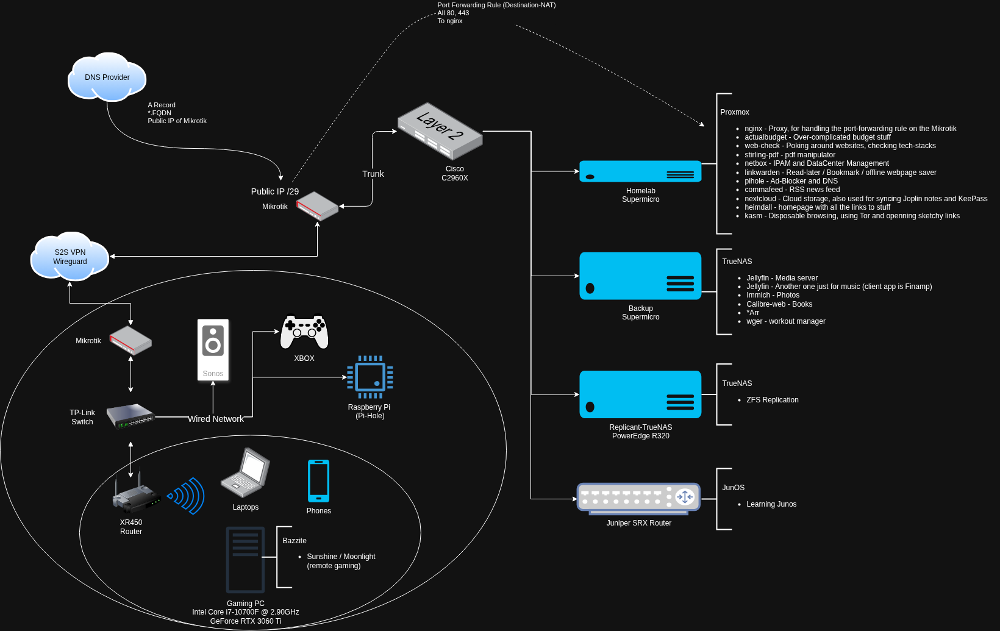

# My Homelab
This is my Homelab, below is a brief overview and a diagram.

## Summary
My home lab consists of a media server (Jellyfin), a personal cloud (Nextcloud), a photo repository (Immich), DNS server (Pi-Hole) and a proxy (nginx) to make services publicly accessible. The lab is running on enterprise server hardware (Dell PowerEdge and Supermicro) with Proxmox as the hypervisor. The cluster’s containers and virtual machines (VMs) back up using a storage-network (ZFS over iSCSI) to a physically-separate Proxmox Backup Server. For added security, the network is segmented with VLANs using a Cisco switch and a port-monitor is in place for tracking down suspicious activity. The firewalls are Mikrotiks running a Site-to-Site (S2S) VPN between my home and the lab equipment, located at the data center. I keep the lab organized and well-documented with a self-hosted wiki and IP-management database. The database serves as a source of truth for Ansible to automate network configuration changes using an API.

## Diagram
Right-click and open image in new tab to view the full-sized diagram.

